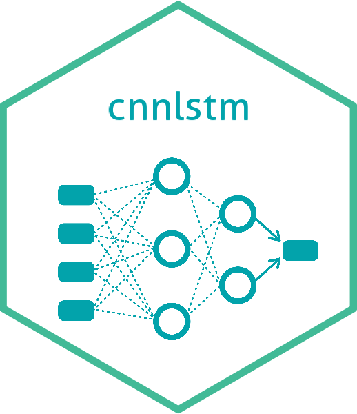

<!-- README.md is generated from README.Rmd. Please edit that file -->
<!-- badges: start -->

[](https://github.com/cjrincon/cnnlstm/actions/workflows/R-CMD-check.yaml)
<!-- badges: end -->

# cnnlstm 

The `cnnlstm` package provides functions to carry out the methodology
CNN-LSTM in `R`:

- Split data

- Generate CNN models to smooth the data obtained by sensors

- Generate LSTM models to predict a variable with nonlinear behavior
  over time

- Evaluate performance of prediction model

## Installation

You can install the development version of `cnnlstm` from
[GitHub](https://github.com/cjrincon/cnnlstm). It is recommended to
follow these steps to avoid problems when using the package:

``` r
# Step 1: Install the reticulate package
install.packages("reticulate")
library(reticulate)

# Step 2: Install the tensorflow package
## Option 1:
install.packages("tensorflow")
library(tensorflow)
## Option 2:
install.packages("remotes")
remotes::install_github("rstudio/tensorflow"))
library(tensorflow)

# Step 3: Validate if python is installed on the system. If it is installed, continue to the next step. For the installation:
## Option 1: Download python www.python.org/download
## Option 2:
reticulate::install_python()

# Step 4: Use the install_tensorflow() funcion to install the TensorFlow module
install_tensorflow(envname = "r-tensorflow")
 
# Step 5: Install the keras package
install.packages("keras")
library(keras)
install_keras()

# Step 6: Confirm that Tensorflow installation succeeded
tf$constant("Hello Tensorflow!")

# Step 7: Install the devtools package
install.packages("devtools")

# Step 8: Install and load the cnnlstm package
devtools::install_github("cjrincon/cnnlstm")
library(cnnlstm)
```

## Examples

You can visit the [package website](https://cjrincon.github.io/cnnlstm/)
to explore the functions, documentation and examples.
